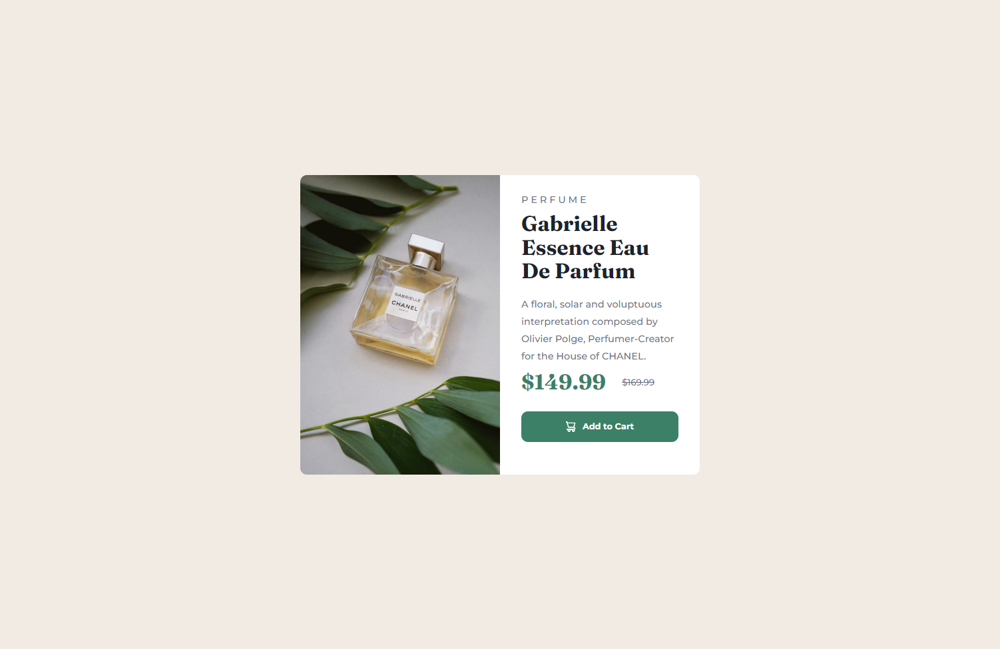

# Frontend Mentor - Product preview card component solution

This is a solution to the [Product preview card component challenge on Frontend Mentor](https://www.frontendmentor.io/challenges/product-preview-card-component-GO7UmttRfa). 

Frontend Mentor challenges help you improve your coding skills by building realistic projects. 

## Table of contents

- [Overview](#overview)
  - [The challenge](#the-challenge)
  - [Screenshot](#screenshot)
  - [Links](#links)
- [My process](#my-process)
  - [Built with](#built-with)
  - [What I learned](#what-i-learned)
- [Author](#author)

## Overview
---
### The challenge
---
Users should be able to:

- View the optimal layout depending on their device's screen size
- See hover and focus states for interactive elements

### Screenshot
---



### Links
---
- Solution URL: [Github](https://github.com/Fqthom/Perfume)
- Live Site URL: [Github Pages](https://Fqthom.github.io/Perfume)

## My process
---
### Built with
---
- Semantic HTML5 markup
- CSS custom properties
- Flexbox
- SASS
- CSS Variables

### What I learned
---
This, although a simple page was my first jump into SCSS. It was a bit tricky getting everything set up initially. After getting @Forward working and the SASS Compiler set up, it was a breeze. I think going forward I will be utilizing it more than CSS.

Getting used to inset selectors
```scss
#atc{
        display: flex;
        justify-content: center;
        height: auto;
        background-color: var(--purchase-color);
        color: white;
        font-size: .8rem;
        font-weight: 700;
        padding: 15px 30px;
        border-radius: 10px;
        margin-top: 25px;
        transition: .3s ease-in-out;

        &:hover{
            background-color: var(--click-color);
            transition: .3s ease-in-out;
        }
    }
```
My first SCSS variables
```scss
:root {
    --background-color: hsl(30, 38%, 92%);
    --title-color: hsl(212, 21%, 14%);
    --text-color:   hsl(228, 12%, 48%);
    --container-color: hsl(0, 0%, 100%);
    --purchase-color: hsl(158, 36%, 37%);
    --click-color: hsl(156, 42%, 18%);
}
```

## Author
---
- Website - [Github](https://github.com/Fqthom)
- Frontend Mentor - [@Fqthom](https://www.frontendmentor.io/profile/Fqthom)